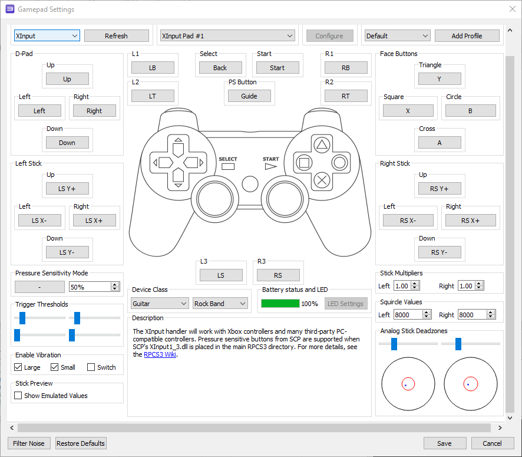

# Connecting your RB4 Guitar to RPCS3
## Prerequisites
* A Windows PC
* An Xbox One RB4 Guitar
* An Xbox Wireless Adapter for Windows (Official or Unofficial)
* [WinPCap](https://www.winpcap.org/install/bin/WinPcap_4_1_3.exe) and [USBPCap](https://desowin.org/usbpcap/)
* [VJoy](https://github.com/jshafer817/vJoy/releases/latest) 
* [GuitarSniffer](https://github.com/artman41/guitarsniffer)
* [x360ce](https://x360ce.com/) (The "Download for All Games" button)
* [RPCS3](https://rpcs3.net/)

## Connecting and Pairing the Guitar
Follow the instructions at [this page.](connecting.md)     
Run GuitarSniffer.

## Configuring x360ce
1. Run the x360ce program. (Make sure GuitarSniffer is running first)
2. Choose vJoy Device as the mapped controller.
3. Click "Enable 1 Mapped Device".
4. Copy the contents of [this file](https://raw.githubusercontent.com/qfoxb/RB4Guitar4PC/main/resources/x360ce.xml) to your clipboard.
5. Click "Paste Preset". and the buttons and joysticks should autofill. 

## Configuring RPCS3
1. Open the RPCS3 emulator. 
2. Click on the "Pads" button.
3. Select "XInput" as the Handler.
4. Leave the device as "XInput Pad 1".
5. Change "Device Class" to Guitar and the type to Rock Band.
6. Verify that the buttons and joysticks are mapped correctly according to this image below.

7. Save your changes.

# Done!

